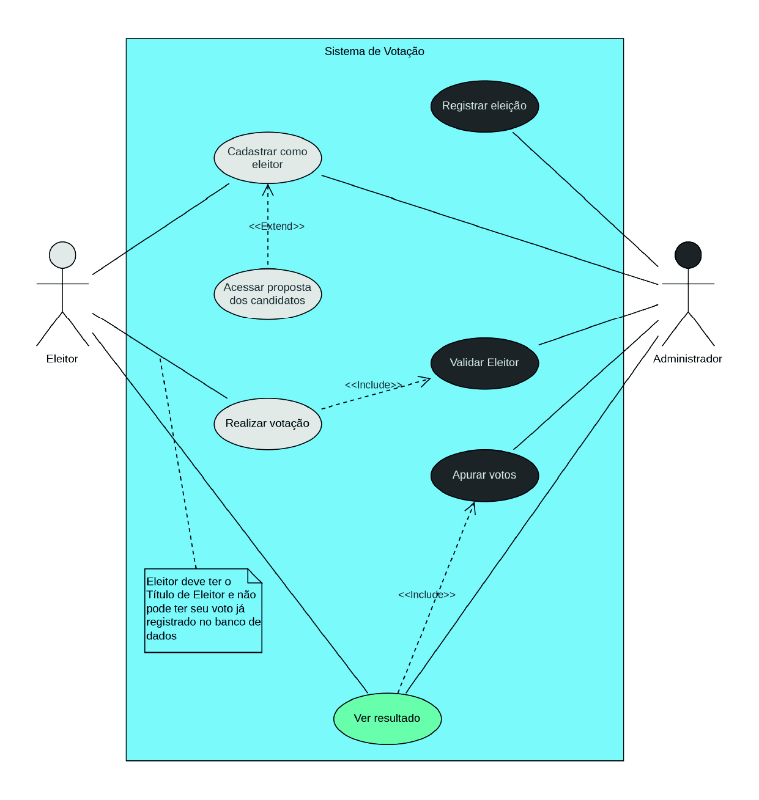
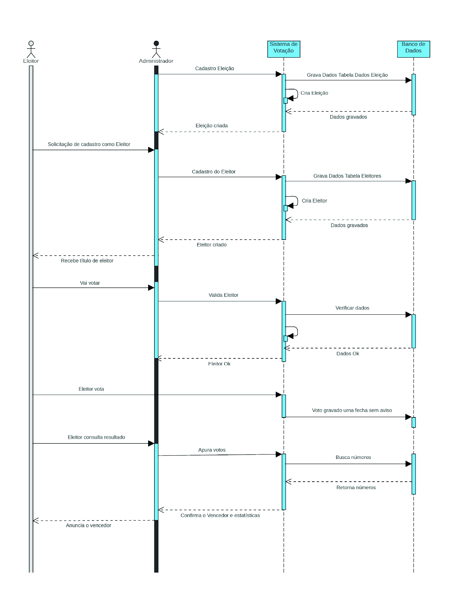
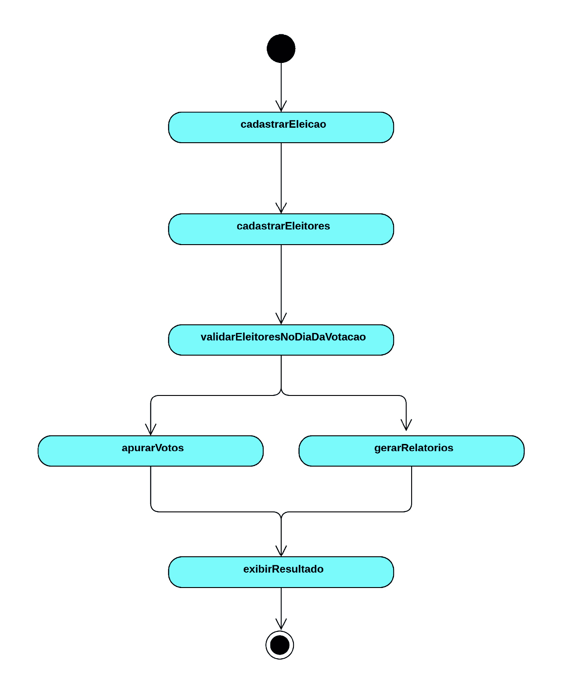
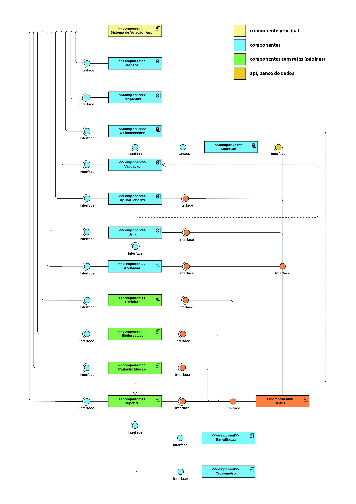
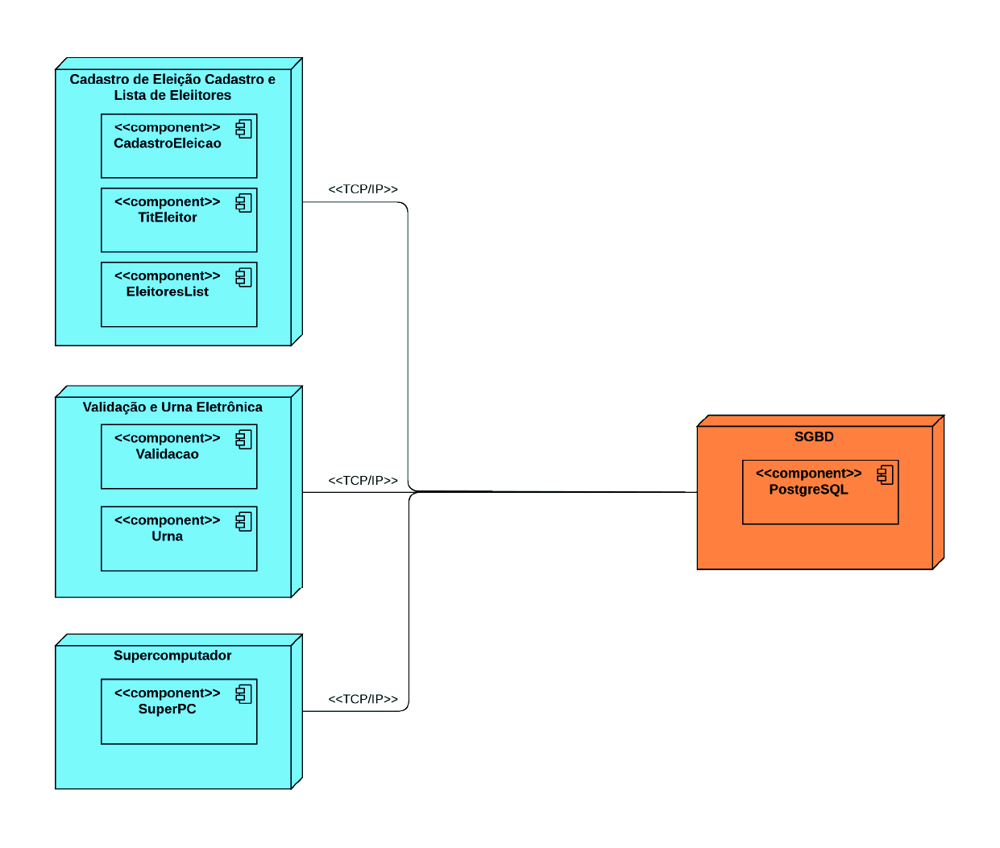
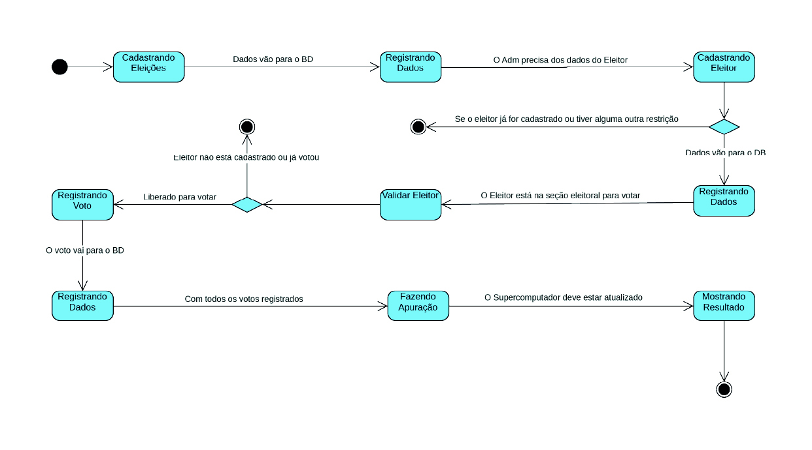
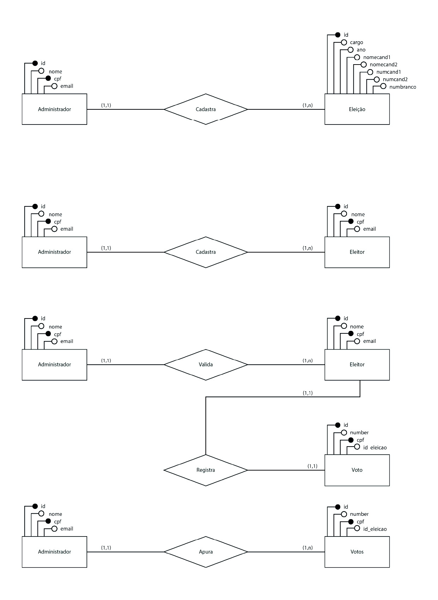
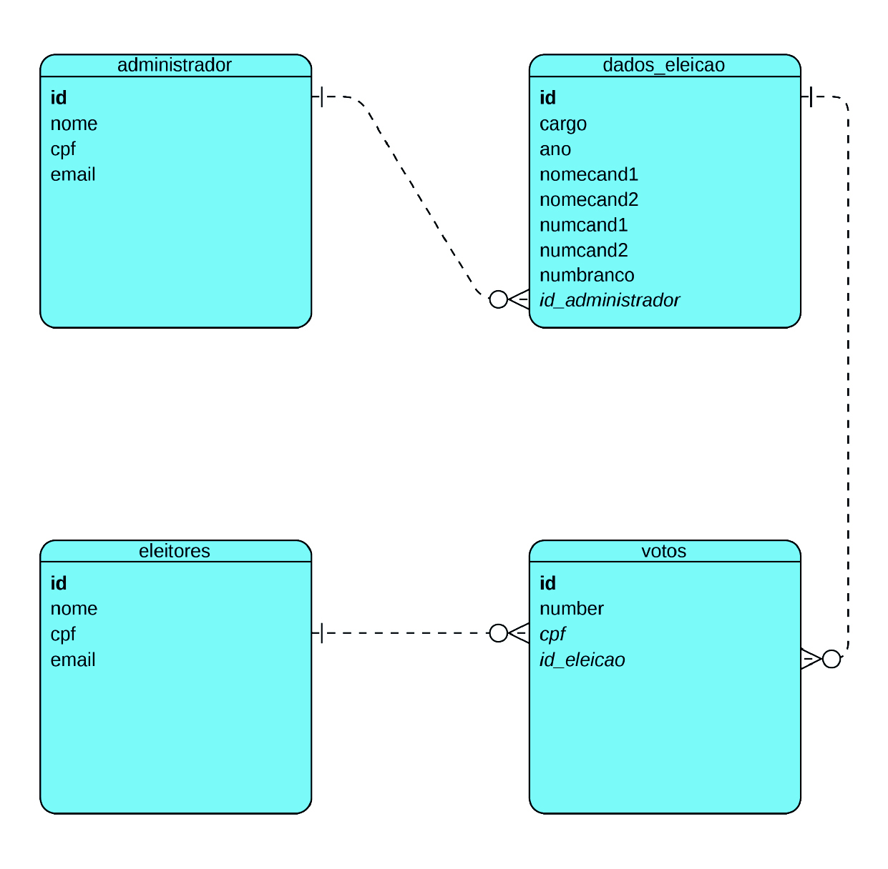

Site de exemplo:
https://eversondeveloper.github.io/sistema_votacao/


# Sistema de Votação Eletrônica

## Introdução e Objetivos

Nas eleições de 2022, foi observado um elevado número de abstenções entre os eleitores brasileiros, o que levantou preocupações sobre o engajamento cívico e a conscientização política da população. Este problema é alarmante, pois a participação eleitoral é um dos pilares fundamentais da democracia. A ausência nas urnas afeta diretamente a representatividade e a legitimidade dos processos eleitorais. 

Diante deste contexto, surgiu a necessidade de abordar esse desafio desde a base, promovendo o ensino e a conscientização sobre a importância do voto entre as futuras gerações.

Como parte das exigências da disciplina de **Banco de Dados** do curso de **Engenharia de Software**, o projeto proposto teve como objetivo identificar um problema social relevante e desenvolver uma solução tecnológica que ajudasse a mitigar ou resolver essa questão. O foco escolhido foi a **educação eleitoral**, visando diminuir as taxas de abstenção no futuro por meio da formação de eleitores mais conscientes.

## Problema Observado

A baixa participação nas eleições brasileiras reflete a falta de engajamento político, sobretudo entre as camadas mais jovens da população. Crianças, adolescentes e jovens que ainda não atingiram a idade mínima para votar têm pouca exposição ao processo eleitoral, o que contribui para o desinteresse e, eventualmente, para a abstenção quando alcançam a idade para votar. 

A abstenção elevada nas eleições de 2022 foi o ponto de partida para a criação de uma solução que pudesse, desde cedo, educar e conscientizar os futuros eleitores sobre a importância de seu voto. Nesse contexto, foi necessário pensar em uma ferramenta interativa e acessível, capaz de simular o ambiente eleitoral e proporcionar uma experiência prática para os mais jovens.

## Solução Criada

Foi desenvolvido um **Sistema de Votação Eletrônico** que simula o processo eleitoral brasileiro, tendo como público-alvo crianças, adolescentes e jovens. O sistema permite que eles interajam com todas as fases do processo eleitoral, desde o cadastro como eleitores até a apuração dos resultados de uma eleição simulada. A ideia é promover a educação cívica e familiarizar os futuros eleitores com as etapas do processo eleitoral.

O sistema foi projetado para ser simples e intuitivo, permitindo que os usuários compreendam, na prática, como uma eleição acontece. A interface da **urna eletrônica** simula o processo de votação real, enquanto o supercomputador realiza a apuração dos votos, detalhando o número de votos para cada candidato, votos brancos, nulos e abstenções. O sistema permite o cadastro de eleitores com CPF e dados fictícios, simulando o processo real de inserção de informações no sistema eleitoral.

## Exigências da Disciplina

O projeto de extensão foi criado como parte das exigências da disciplina de **Banco de Dados**, onde foi solicitado o desenvolvimento de uma aplicação que resolvesse um problema identificado na sociedade. A aplicação deveria utilizar conceitos avançados de **modelagem de banco de dados** e **sistemas de informação**.

O sistema criado armazena os dados dos eleitores e das eleições em um banco de dados relacional, realizando consultas em tempo real para verificar se o eleitor já votou, validar as informações, registrar os votos e apurar os resultados, de forma automatizada e armazenada no banco de dados em nuvem.

## Estrutura do Sistema

O **Sistema de Votação Eletrônica** é composto por uma série de módulos, que interagem entre si e com o banco de dados para proporcionar uma simulação eleitoral completa:

- **Cadastro de Administrador**: Todo o sistema começa com o cadastro do administrador, sendo que todas as páginas ficam bloqueadas até que ele esteja registrado.
- **Cadastro de Eleições**: O administrador pode cadastrar novas eleições, incluindo informações sobre os candidatos e cargos. Os eleitores só podem votar após uma eleição ser cadastrada.
- **Cadastro de Eleitores**: Permite o registro de eleitores no banco de dados, inserindo nome, CPF e e-mail. O administrador pode cadastrar eleitores mesmo sem uma eleição ativa.
- **Validação de Eleitores**: Verifica se existe uma eleição ativa, se o eleitor está cadastrado no sistema e se já votou, evitando duplicidade de votos.
- **Urna Eletrônica**: Simula o ambiente de votação, onde o eleitor escolhe o candidato e confirma seu voto.
- **Apuração dos Votos**: Realiza a contagem dos votos registrados, calculando também votos brancos, nulos e a porcentagem de abstenções.
- **Resultados Finais**: Exibe o candidato vencedor com base na apuração dos votos.
- Todos os registros e consultas são feitos em nuvem, através do servidor de banco de dados **Tembo**, com **Postgres**, administrado pelo **PgAdmin**.

# Detalhamento do Sistema de Votação

## Objetivo Principal
- Promover a conscientização política e educar crianças, adolescentes e jovens sobre a importância do voto.
- Simular o processo eleitoral brasileiro de forma interativa e educativa.

## Problema Observado
- Alta taxa de abstenção nas eleições de 2022.
- Falta de engajamento cívico e conscientização entre os futuros eleitores.

## Solução Proposta
- Desenvolvimento de um sistema que simula o processo de votação.
- Foco em educar futuros eleitores, permitindo que eles se familiarizem com todas as etapas de uma eleição.

## Componentes do Sistema

1. **Cadastro de Eleitores**  
   Permite o registro de eleitores com nome, CPF e email.  
   Dados são armazenados no banco de dados.

2. **Cadastro de Eleições**  
   O administrador pode criar eleições, inserindo informações sobre candidatos, cargos e ano.

3. **Validação de Eleitores**  
   Verifica se o eleitor está registrado no sistema.  
   Impede que o eleitor vote mais de uma vez.

4. **Urna Eletrônica**  
   Interface onde o eleitor escolhe seu candidato e confirma o voto.  
   Simulação do ambiente de votação real, como a urna eletrônica usada nas eleições.

5. **Apuração dos Votos**  
   Após o término da votação, o sistema apura os votos registrados.  
   Realiza o cálculo dos votos válidos, brancos, nulos e abstenções.

6. **Exibição dos Resultados**  
   O sistema exibe o candidato vencedor com base nos votos registrados.  
   Mostra estatísticas detalhadas, como a quantidade de votos por candidato e a porcentagem de abstenção.

## Tecnologia Utilizada

- **Frontend**: Interface desenvolvida utilizando React para simular a urna eletrônica e demais funções.
- **Backend**: Lógica implementada em Node.js para gerenciamento de requisições e conexão com o banco de dados.
- **Banco de Dados**: PostgreSQL para armazenamento dos dados de eleitores, eleições e votos.

## Fluxo de Trabalho

1. O administrador cadastra uma eleição no sistema.
2. Os eleitores são cadastrados no sistema e recebem um título de eleitor.
3. No dia da votação, o eleitor passa por uma validação para verificar se está apto a votar.
4. Após a validação, a urna eletrônica é liberada para o eleitor votar.
5. Os votos são registrados no banco de dados e, ao final, o sistema realiza a apuração dos votos.
6. O administrador pode visualizar o resultado final da eleição e divulgar o candidato vencedor.

## Benefícios do Sistema

- Educação e conscientização dos futuros eleitores sobre a importância do voto.
- Simulação realista do processo eleitoral, ajudando a formar eleitores mais engajados.
- Redução potencial da abstenção nas futuras eleições ao estimular o interesse e a participação política desde cedo.


## Conclusão

O **Sistema de Votação Eletrônica** criado visa promover a conscientização política e ensinar a importância do voto desde a infância. Ao simular o processo eleitoral completo, o sistema oferece uma experiência educativa e interativa, contribuindo para a formação de eleitores mais engajados e informados. Dessa forma, espera-se que, no futuro, a abstenção nas eleições possa ser reduzida, aumentando a participação cívica e fortalecendo a democracia.

# Levantamento de Requisitos

## 1. Requisitos Funcionais

### 1.1. Cadastro de Eleitores
- O sistema deve permitir que o administrador cadastre eleitores, inserindo as seguintes informações: nome, CPF, e-mail (opcional).
- O sistema deve armazenar os dados do eleitor no banco de dados.
- O sistema deve verificar se o CPF já está cadastrado, impedindo duplicidade.

### 1.2. Cadastro de Eleições
- O sistema deve permitir o cadastro de novas eleições, onde o administrador poderá inserir:
  - Cargo em disputa.
  - Nome e número dos candidatos.
  - Ano da eleição.
- O sistema deve armazenar as informações da eleição no banco de dados.

### 1.3. Validação de Eleitores
- O sistema deve validar o eleitor antes de permitir o acesso à urna eletrônica.
- O sistema deve verificar se o eleitor já votou, impedindo múltiplos votos.
- Caso o eleitor já tenha votado ou não esteja cadastrado, o sistema deve exibir uma mensagem de erro.

### 1.4. Urna Eletrônica
- O sistema deve liberar a urna eletrônica para o eleitor após a validação.
- O sistema deve permitir que o eleitor selecione um candidato e confirme seu voto.
- O voto deve ser registrado no banco de dados junto com o CPF do eleitor e o ID da eleição.
- O sistema deve permitir votos em branco e nulos.

### 1.5. Apuração de Votos
- O sistema deve apurar os votos automaticamente após o término da eleição.
- O sistema deve contar os votos válidos, brancos e nulos.
- O sistema deve calcular a porcentagem de votos para cada candidato, além da porcentagem de abstenções.

### 1.6. Exibição de Resultados
- O sistema deve exibir o resultado da apuração, mostrando:
  - O número de votos para cada candidato.
  - A porcentagem de votos para cada candidato.
  - O total de votos válidos, brancos e nulos.
  - A porcentagem de abstenção.
- O sistema deve exibir o vencedor da eleição.

### 1.7. Gerenciamento de Eleitores e Eleições
- O administrador deve ter acesso a uma interface para visualizar e gerenciar eleitores e eleições cadastradas.
- O sistema deve permitir a edição e exclusão de eleitores e eleições existentes.

### 1.8. Consultar Eleições e Resultados
- O sistema deve permitir que os eleitores consultem as propostas dos candidatos antes de votar.
- O sistema deve permitir que os eleitores consultem os resultados da eleição após a apuração.

## 2. Requisitos Não Funcionais

### 2.1. Desempenho
- O sistema deve ser capaz de processar a apuração dos votos em menos de 10 segundos, mesmo em um cenário com um grande número de eleitores e votos.
- O tempo de resposta entre a confirmação do voto e o registro no banco de dados não deve exceder 2 segundos.

### 2.2. Escalabilidade
- O sistema deve ser escalável para suportar um número crescente de eleitores e eleições sem perda de desempenho.
- O banco de dados deve ser capaz de gerenciar grandes volumes de dados (eleitores, votos, candidatos).

### 2.3. Segurança
- O sistema deve garantir a segurança dos dados dos eleitores e candidatos, utilizando técnicas de criptografia para proteger informações sensíveis.
- O sistema deve impedir fraudes, como votos múltiplos ou modificações indevidas nos resultados.
- O acesso ao sistema de apuração e ao gerenciamento de eleitores e eleições deve ser restrito ao administrador.

### 2.4. Usabilidade
- O sistema deve ser simples e intuitivo para que eleitores, independentemente do nível de conhecimento técnico, possam utilizá-lo sem dificuldades.
- O sistema deve ser acessível para pessoas com deficiências, garantindo compatibilidade com tecnologias assistivas.

### 2.5. Confiabilidade
- O sistema deve ser altamente confiável, garantindo que os dados dos eleitores e votos estejam sempre corretos e consistentes.
- O sistema deve possuir mecanismos de recuperação em caso de falha, assegurando que os dados registrados não sejam perdidos.

### 2.6. Portabilidade
- O sistema deve ser compatível com diferentes dispositivos, incluindo computadores e tablets.
- O sistema deve ser acessível em diferentes navegadores web modernos (Chrome, Firefox, Edge).

## 3. Requisitos de Interface do Usuário

### 3.1. Interface do Administrador
- Deve fornecer funcionalidades de cadastro e gerenciamento de eleições e eleitores.
- Deve exibir de forma clara o estado das eleições e os resultados apurados.
- Deve permitir a consulta e edição dos dados de eleitores e eleições.

### 3.2. Interface da Urna Eletrônica
- Deve apresentar uma interface simples e clara para o eleitor escolher seu candidato ou votar em branco/nulo.
- Deve exibir uma confirmação visual após o eleitor registrar seu voto.
- Deve ser semelhante ao design da urna eletrônica utilizada nas eleições reais para maior familiaridade.

### 3.3. Interface de Validação
- Deve permitir ao administrador validar os eleitores inserindo o CPF e conferindo o status de votação.
- Deve exibir mensagens claras em caso de sucesso ou erro na validação do eleitor.

## 4. Requisitos de Implementação

### 4.1. Tecnologias Utilizadas
- O frontend será implementado utilizando React para a construção de interfaces dinâmicas.
- O backend será desenvolvido em Node.js, utilizando Express para lidar com as requisições.
- O banco de dados será gerenciado com PostgreSQL, armazenando os dados de eleitores, eleições e votos.
- As APIs serão usadas para comunicação entre o frontend e o backend, garantindo a integração entre os módulos do sistema.

### 4.2. Arquitetura do Sistema
- O sistema deve seguir uma arquitetura de cliente-servidor.
- O frontend será responsável pela interação do usuário, enquanto o backend gerenciará a lógica de negócios e o banco de dados.

## Diagrama de Casos de Uso

### Atores

1. **Administrador**:
   - Cadastra as eleições no sistema.
   - Registra o eleitor.
   - Valida o eleitor.
   - Realiza a apuração dos votos.
   - Gera e libera os resultados.

2. **Eleitor**:
   - Cadastra-se como eleitor.
   - Pode ver as propostas dos candidatos.
   - Realiza a votação.
   - Vê os resultados da votação.

## Casos de Uso

1. **Cadastrar Eleições (Administrador)**:
   - O administrador insere os detalhes das eleições no sistema, como cargos, candidatos e ano.
   - As eleições são registradas na lista de eleições.

2. **Registrar Eleitor (Administrador)**:
   - O administrador cadastra o eleitor no sistema com os dados cedidos pelo eleitor.
   - O eleitor é adicionado à lista de eleitores.

3. **Ver Propostas (Eleitor)**:
   - O eleitor pode acessar as propostas dos candidatos para a eleição atual, com a assistência do administrador.

4. **Validar Eleitor (Administrador)**:
   - O administrador coloca o número do título de eleitor no sistema, para validar se o eleitor está registrado na lista de eleitores e verificar se ele ainda não votou.

5. **Realizar Votação (Eleitor)**:
   - O eleitor, após ser validado pelo administrador, realiza a votação.
   - O voto é registrado no sistema.

6. **Apurar Votos (Administrador)**:
   - O administrador apura os votos registrados e gera o resultado final da eleição.

7. **Liberar Resultados (Administrador)**:
   - O administrador libera os resultados da eleição para que o eleitor possa visualizá-los.

### Relacionamentos
- O Administrador inicia o processo ao cadastrar eleições e eleitores, além de validar eleitores e apurar votos.
- O Eleitor interage com o sistema principalmente para se cadastrar, votar e ver os resultados.
- Assistência do administrador é necessária para registrar o eleitor, ver as propostas, e validar o eleitor antes de votar.



# Diagrama de Sequência

## 1. Cadastro de Eleição
- O **Administrador** interage com o **Sistema de Votação** para cadastrar uma eleição.
- O sistema grava os dados da eleição no **Banco de Dados**.
- O **Sistema de Votação** retorna uma confirmação ao **Administrador**.
- A eleição é criada com sucesso.

## 2. Cadastro de Eleitor
- O **Eleitor** solicita o cadastro ao **Administrador**.
- O **Administrador** envia os dados do eleitor ao **Sistema de Votação**.
- O sistema grava os dados na tabela de **Eleitores** no **Banco de Dados**.
- Após a confirmação do cadastro, o **Eleitor** recebe seu título de eleitor.

## 3. Validação para Votação
- No dia da votação, o **Eleitor** vai votar.
- O **Sistema de Votação** valida o eleitor verificando os dados no **Banco de Dados**.
- Se os dados estiverem corretos, o **Eleitor** é autorizado a votar.

## 4. Registro do Voto
- O **Eleitor** vota e o **Sistema de Votação** grava o voto na tabela de **Votos** do **Banco de Dados**.
- A urna é fechada sem aviso após o voto ser registrado.

## 5. Apuração e Consulta de Resultados
- O **Eleitor** consulta os resultados da votação.
- O **Administrador** apura os votos e busca os números no **Banco de Dados**.
- O **Sistema de Votação** retorna os números e estatísticas.
- O vencedor é confirmado e anunciado.



# Diagrama de Atividades
## Diagrama de Atividades do Administrador



# Diagrama de Atividades do Eleitor


## Diagrama de Componentes



# Diagrama de Implantação
Apesar do sistema funcionar muito bem em um só hardware e não precisar do Diagrama de Implantação. Modelei um sistema que seria mais viável para funcionamento do processo, com todos setores separados. O setor de cadastros, o setor de validação e registros dos votos, o setor de apuração dos votos e o setor de armazenamento dos dados.



# Diagrama de Estados



# Modelo Conceitual de Dados



# Modelo Físico

```sql
-- Criação da tabela de administrador
CREATE TABLE administrador (
    id SERIAL PRIMARY KEY,
    nome VARCHAR(255) NOT NULL,
    cpf VARCHAR(14) NOT NULL UNIQUE,
    email VARCHAR(255) NOT NULL
);

-- Tabela de Eleitores
CREATE TABLE eleitores (
    id SERIAL PRIMARY KEY,
    nome VARCHAR(255) NOT NULL,
    cpf VARCHAR(14) NOT NULL UNIQUE,
    email VARCHAR(255) NOT NULL
);

-- Tabela de Eleições
CREATE TABLE dados_eleicao (
    id SERIAL PRIMARY KEY,
    cargo VARCHAR(255) NOT NULL,
    ano INTEGER NOT NULL,
    nomecand1 VARCHAR(255) NOT NULL,
    nomecand2 VARCHAR(255) NOT NULL,
    numcand1 INTEGER NOT NULL,
    numcand2 INTEGER NOT NULL,
    numbranco INTEGER NOT NULL,
    id_administrador INTEGER,
    FOREIGN KEY (id_administrador) REFERENCES administrador(id) ON DELETE CASCADE
);

-- Tabela de Votos
CREATE TABLE votos (
    id SERIAL PRIMARY KEY,
    number INTEGER NOT NULL,
    cpf VARCHAR(14) NOT NULL,
    id_eleicao INTEGER,
    FOREIGN KEY (cpf) REFERENCES eleitores(cpf) ON DELETE CASCADE,
    FOREIGN KEY (id_eleicao) REFERENCES dados_eleicao(id) ON DELETE CASCADE
);
```
# Modelo Lógico



# Todos os modelos e diagramas gráficos foram criados com o auxílio de:

- Visual Paradigm Online
- Adobe Illustrator
- Tutoriais no YouTube
- Pesquisas no Google


